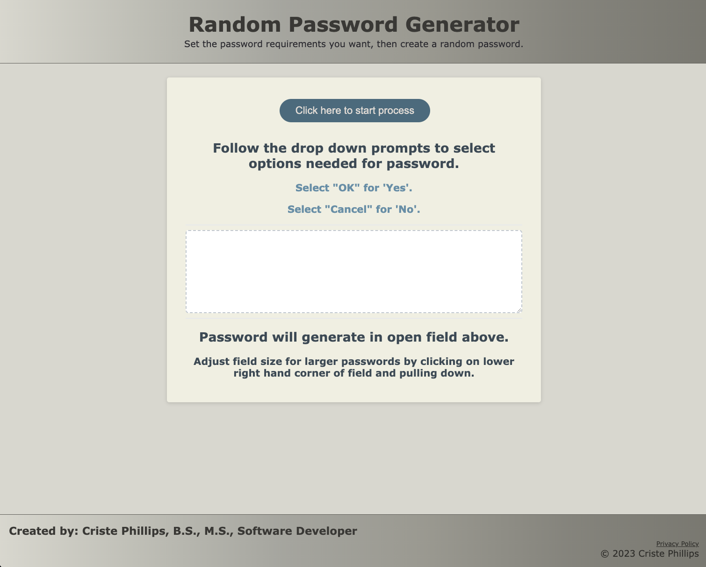

# random-password-generator

## Purpose
A website application designed to... 

## Description
When user enters a 'task name', selects a 'task type' and adds that ..

When user ...

When user ... 

When user ...

When user ...

When user ...

## Built With
* HTML

## Website
https://github.com/cphill11/random-password-generator.git

## Image: 

## Contribution
Criste Phillips.  Sticky paws off unless permitted by creator.