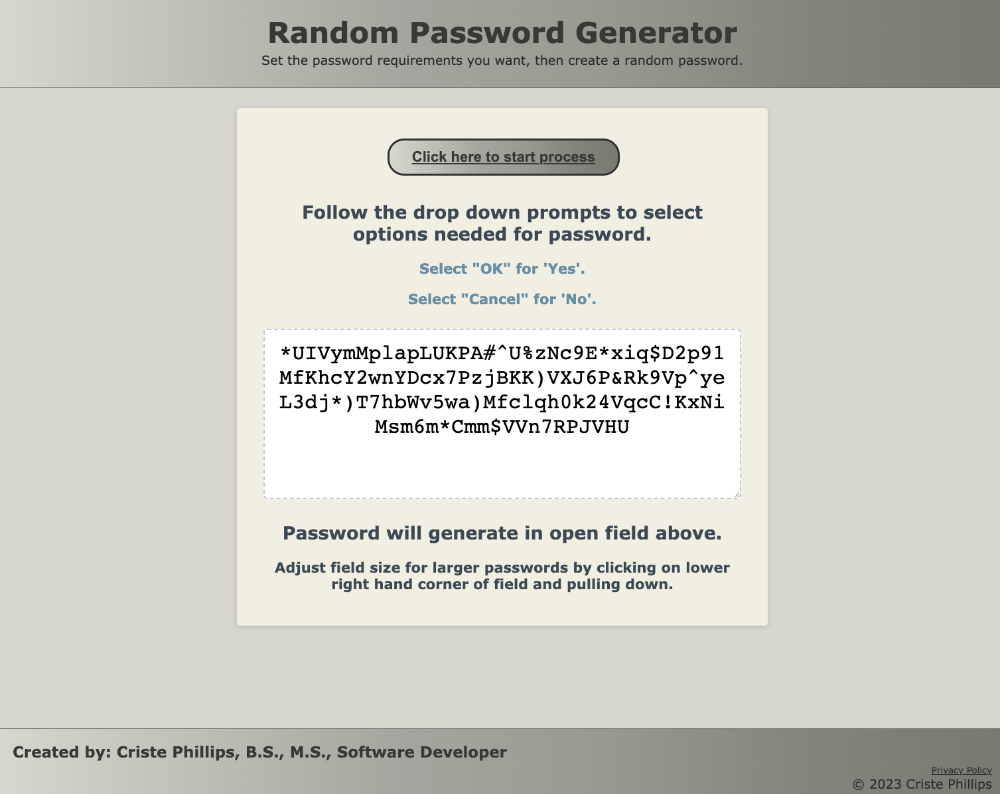

# random-password-generator

## Purpose
A website application designed to generate random passwords for users.

## Description
When user clicks on "Click here to start process" button, button changes color and then user is prompted through a series of dropdown menu options.  

When user first enters the number of characters needed, they are informed of the need to pick between 6 and 225 characters, then give the option to select 'cancel' or 'ok'.  This triggers the next prompt, asking if the user would like to include numbers.

When user clicks 'ok' or 'cancel' in response to the numbers prompt, user is then prompted to decide if they would like to include lower case letters in the new password.

When user clicks 'ok' or 'cancel' in response to the lower case letter prompt, user is then prompted to decide if they would like to include upper case letters in the new password.

When user clicks 'ok' or 'cancel' in response to the upper case letter prompt, user is then prompted to decide if they would like to include symbols in the new password.

When user has toggled through all the prompts, a random password is created for the user to utilize.  With longer passwords, user has the optin to open the field further to show all of the characters generated for the password.

## Built With
* HTML
* CSS
* Javascript

## Website
https://github.com/cphill11/random-password-generator.git

## Image: 
* Image at start of process

* Image with a 150 character password generated

## Contribution
Criste Phillips.  Sticky paws off unless permitted by creator.